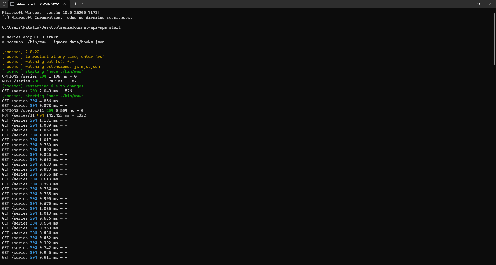
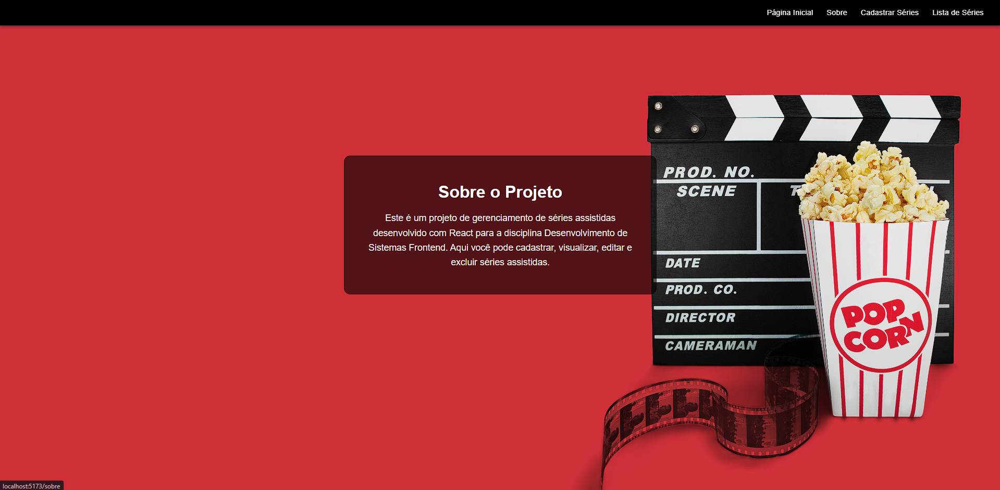
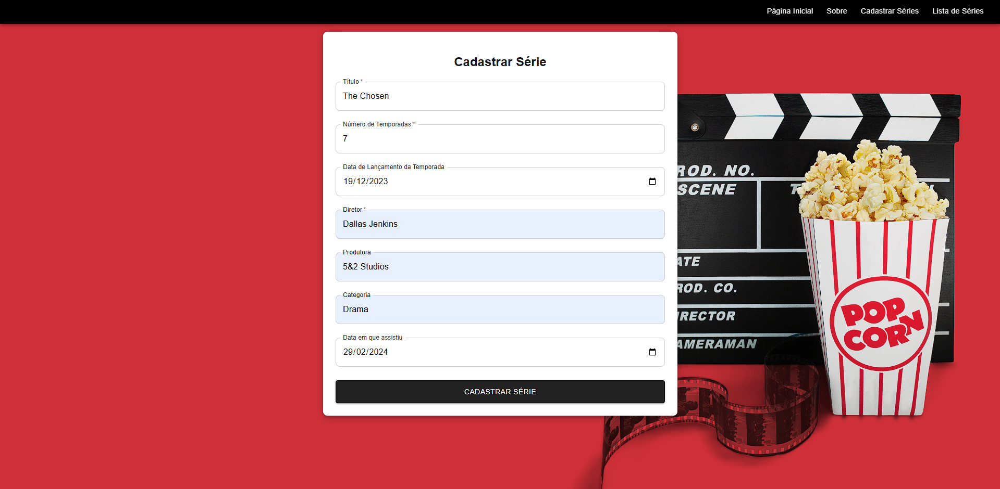
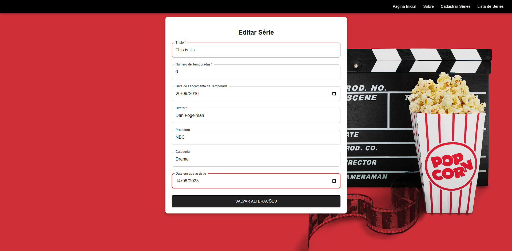
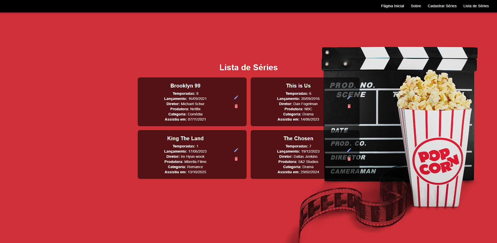
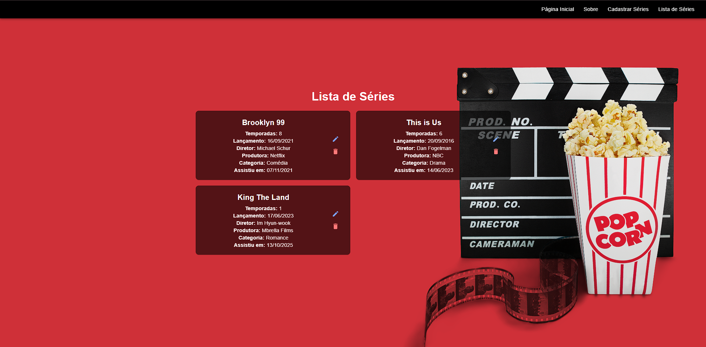
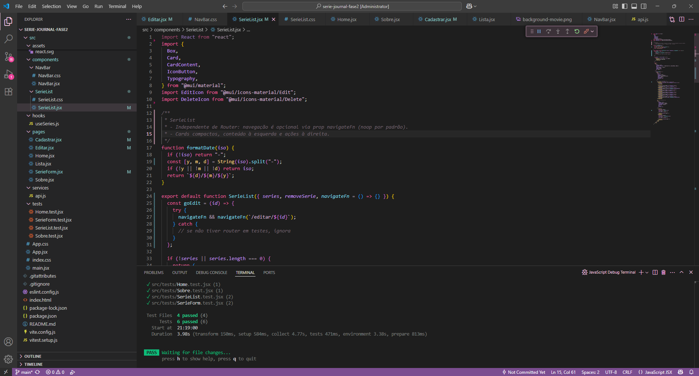

# Serie Journal — Fase 2

Autora: Natalia Prestes Santos Pontes

Projeto desenvolvido para a disciplina Desenvolvimento de Sistemas Frontend (PUCRS) — Fase 2.  
Nesta etapa, a aplicação da Fase 1 evolui para um CRUD dinâmico com API real, React Router, Material UI, Axios e testes automatizados (Vitest + React Testing Library).

---

## Sumário
- [Tecnologias](#tecnologias)
- [Requisitos](#requisitos)
- [Como executar](#como-executar)
  - [1) Clonar este projeto](#1-clonar-este-projeto)
  - [2) Instalar dependências do frontend](#2-instalar-dependências-do-frontend)
  - [3) Subir a API do professor](#3-subir-a-api-do-professor)
  - [4) Rodar o frontend](#4-rodar-o-frontend)
  - [5) Rodar os testes](#5-rodar-os-testes)
- [Rotas da aplicação](#rotas-da-aplicação)
- [Operações na API](#operações-na-api)
- [O que foi implementado](#o-que-foi-implementado)
- [Estrutura do projeto](#estrutura-do-projeto)
- [Screenshots](#screenshots)
- [Dicas e troubleshooting](#dicas-e-troubleshooting)
- [Como o projeto atende aos critérios da Fase 2](#como-o-projeto-atende-aos-critérios-da-fase-2)

---

## Tecnologias
- React 18 + Vite
- React Router DOM 6
- Material UI (MUI)
- Axios
- Vitest + React Testing Library (RTL)
- JSDOM (ambiente de testes)

---

## Requisitos
- Node.js e npm
- API do professor rodando localmente (porta 5000 por padrão)

---

## Como executar

### 1) Clonar este projeto
```bash
git clone https://github.com/nataliaprs/serie-journal-fase2
cd serie-journal-fase2

2) Instalar dependências do frontend

npm install

3) Subir a API do professor
A API oficial está no repositório da disciplina (branch main):

Repositório: https://github.com/adsPucrsOnline/DesenvolvimentoFrontend/tree/main/serieJournal-api

Passos:

# em um terminal separado
cd <pasta-onde-você-clonou>/DesenvolvimentoFrontend/serieJournal-api
npm install
npm start

A API subirá em:
http://localhost:5000

Observação: a baseURL do Axios está configurada em:

src/services/api.js

4) Rodar o frontend

# dentro da pasta serie-journal-fase2
npm run dev

Acesse no navegador:
http://localhost:5173

5) Rodar os testes

npm test

Você deve ver algo como:

Test Files 4 passed (4)
Tests 6 passed (6)

Rotas da aplicação
/ → Home
/sobre → Página informativa
/cadastrar → Cadastro de série (formulário MUI)
/lista → Listagem de séries (cards compactos)
/editar/:id → Edição de série (reaproveita o mesmo formulário)

Operações na API
A aplicação consome a API local do professor com os endpoints:

GET /series
GET /series/:id
POST /series
PUT /series/:id (padrão json-server)
PUT /series (fallback com id no body — usado caso o /:id não esteja disponível)
DELETE /series/:id

OBS: O update implementa:

1. Atualização otimista (a UI já reflete a mudança).
2. PUT em /series/:id; se houver 404, tenta PUT em /series com id no body.
3. fetchSeries() para sincronizar a listagem.

O que foi implementado
- UI com Material UI (NavBar, Cards, Paper, TextField, etc.)
- Formulário de cadastro/edição com rótulos visíveis para inputs type="date" via:
- InputLabelProps={{ shrink: true }}
- CRUD completo com Axios:
-> Listagem, criação, edição, exclusão

- Rotas com React Router 6
- Testes unitários com Vitest + RTL (Home, Sobre, Lista, Form)
- Ajustes de acessibilidade (mensagens de sucesso/erro com aria-live/role)
- Layout responsivo e “clean” (cards compactos na listagem)
- Estilização por CSS + overrides para formulário claro

# Estrutura do projeto

src/
  assets/
  components/
    NavBar/
    SerieList/
  hooks/
    useSeries.js
  pages/
    Home.jsx
    Sobre.jsx
    Lista.jsx
    Cadastrar.jsx
    Editar.jsx
    SerieForm.jsx
  services/
    api.js
  tests/
    Home.test.jsx
    Sobre.test.jsx
    SerieList.test.jsx
    SerieForm.test.jsx
App.jsx
main.jsx
index.css

# Scripts:

{
  "scripts": {
    "dev": "vite",
    "build": "vite build",
    "preview": "vite preview",
    "test": "vitest"
  }
}

## Screenshots

- API rodando  
  

- Home  
  

- Sobre  
  

- Cadastrar Série  
  

- Editar Série  
  

- Lista de Séries  
  

- Série Atualizada  
  

- Exclusão de Série  
  

- Testes passando  
  


# Dicas e troubleshooting

API não atualiza com PUT /series/:id?
O projeto tenta /series/:id e, se der 404, faz PUT /series com id no body (fallback compatível com o enunciado).
Inputs de data sem rótulo?
MUI exige InputLabelProps={{ shrink: true }} para type="date".
Texto dos inputs do formulário claro estava branco?
Foi aplicado override em .light-form no index.css para garantir cor preta.
Base da API
Ajustável em src/services/api.js (padrão: http://localhost:5000).

## Se precisar de ajustes de última hora, confira a baseURL em src/services/api.js e reinicie a API e o frontend.
